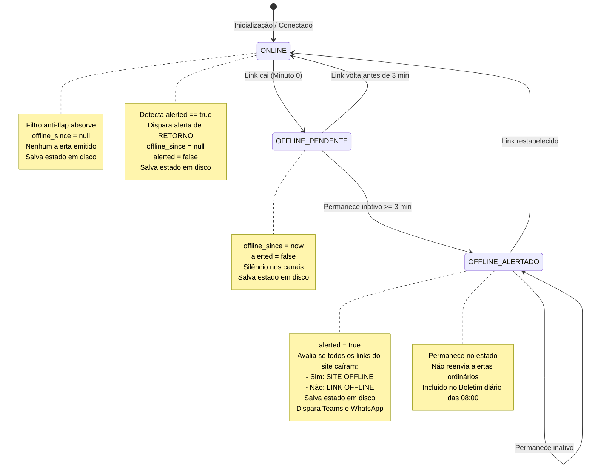

# Data Model: Monitoramento Cato Networks

**Feature**: [spec.md](spec.md) | **Branch**: `001-cato-socket-monitoring` | **Date**: 2026-09-22

Este documento descreve os modelos de dados conceituais, lógicos e os esquemas de armazenamento persistente adotados pela automação de monitoramento de sockets da Cato Networks.

---

## 1. Entidades Principais

### 1.1 Site (Filial)
Representa a localidade física conectada pelo firewall/socket Cato.

| Campo | Tipo | Descrição | Regras de Validação |
|-------|------|-----------|----------------------|
| `id` | String | Identificador do site na Cato Networks | Obrigatório, não-nulo |
| `name` | String | Nome amigável da filial (ex: "Filial SP - Matriz") | Obrigatório, exibido nos alertas |
| `connectionState` | String | Estado geral reportado pela Cato (`Connected`, `Disconnected`) | Opcional |
| `links` | Dict[str, Link] | Dicionário de links/túneis pertencentes ao site | Mínimo 1 link associado |

### 1.2 Link (Interface / Conexão WAN)
Representa uma conexão ou túnel de internet específico de um Site.

| Campo | Tipo | Descrição | Regras de Validação |
|-------|------|-----------|----------------------|
| `name` | String | Nome identificador da interface/túnel (ex: "WAN-01 Claro", "WAN-02 Vivo") | Obrigatório |
| `site_name` | String | Nome do site ao qual o link pertence | Obrigatório |
| `raw_status` | String | Status bruto retornado pela API (`CONNECTED`, `DISCONNECTED`) | Obrigatório |
| `is_connected` | Boolean | Booleano normalizado indicando conectividade ativa | Calculado a partir de `raw_status` |

### 1.3 LinkState (Estado Persistido de Link)
Representa o estado rastreado de um link específico armazenado no arquivo `estado_links.json`.

| Campo | Tipo | Descrição | Regras de Validação |
|-------|------|-----------|----------------------|
| `status` | String | Estado normalizado (`"ONLINE"` ou `"OFFLINE"`) | Valor restrito: `"ONLINE"` ou `"OFFLINE"` |
| `offline_since` | Optional[String] | Timestamp ISO-8601 da primeira detecção de queda | Nulo se status for `"ONLINE"`; Preenchido se `"OFFLINE"` |
| `alerted` | Boolean | Indica se a notificação de queda de 3 minutos já foi despachada | `True` após envio do alerta aos 3 minutos; `False` enquanto pendente |
| `last_alert_type` | Optional[String] | Tipo do último alerta disparado | `"LINK OFFLINE"` ou `"SITE OFFLINE"`; nulo se `alerted` for `False` |
| `last_alert_timestamp` | Optional[String] | Timestamp ISO-8601 do despacho do alerta | Registrado no momento do envio |

### 1.4 IncidentReport (Alerta de Notificação)
Representa a carga de dados montada para disparo de alerta aos canais de comunicação.

| Campo | Tipo | Descrição |
|-------|------|-----------|
| `site_name` | String | Nome amigável do site afetado |
| `link_name` | String | Nome do link específico ou indicação de todos |
| `alert_category` | Enum | `"SITE OFFLINE"`, `"LINK OFFLINE"`, `"RETORNO"`, `"BOLETIM_DIARIO"` |
| `started_at` | Datetime | Momento inicial da queda |
| `downtime_duration` | Timedelta | Tempo decorrido de indisponibilidade |
| `message_body` | String | Texto formatado para o canal de destino |

---

## 2. Máquina de Estados de Conectividade do Link



---

## 3. Esquema JSON de Persistência (`estado_links.json`)

O arquivo persiste a estrutura abaixo de forma atômica:

```json
{
  "$schema": "http://json-schema.org/draft-07/schema#",
  "title": "MonitoringState",
  "type": "object",
  "properties": {
    "last_check": {
      "type": "string",
      "format": "date-time"
    },
    "sites": {
      "type": "object",
      "additionalProperties": {
        "type": "object",
        "properties": {
          "links": {
            "type": "object",
            "additionalProperties": {
              "type": "object",
              "properties": {
                "status": { "type": "string", "enum": ["ONLINE", "OFFLINE"] },
                "offline_since": { "type": ["string", "null"], "format": "date-time" },
                "alerted": { "type": "boolean" },
                "last_alert_type": { "type": ["string", "null"], "enum": ["LINK OFFLINE", "SITE OFFLINE", null] },
                "last_alert_timestamp": { "type": ["string", "null"], "format": "date-time" }
              },
              "required": ["status", "alerted"]
            }
          }
        },
        "required": ["links"]
      }
    }
  },
  "required": ["last_check", "sites"]
}
```
