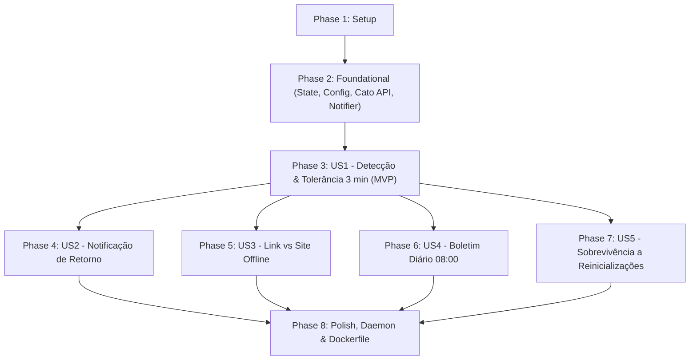

# Implementation Tasks: Monitoramento de Sockets Cato Networks

**Feature**: [spec.md](spec.md) | **Plan**: [plan.md](plan.md) | **Branch**: `001-cato-socket-monitoring` | **Date**: 2026-09-22

Este documento detalha o conjunto ordenado de tarefas técnicas para implementação da automação de monitoramento de sockets Cato Networks, estruturado estritamente por histórias de usuário e em total conformidade com a [Constituição do Projeto](../../.specify/memory/constitution.md).

---

## Phase 1: Setup (Shared Infrastructure)

**Purpose**: Inicialização do ambiente de desenvolvimento, dependências e infraestrutura básica de testes.

- [X] T001 Update dependencies in requirements.txt to include pytest and pytest-mock
- [X] T002 [P] Create documented environment variables template in .env.example
- [X] T003 [P] Create shared test fixtures and environment mocking in tests/conftest.py

---

## Phase 2: Foundational (Blocking Prerequisites)

**Purpose**: Componentes essenciais de infraestrutura e garantias constitucionais que bloqueiam todas as histórias de usuário.

> **CRITICAL**: Nenhuma história de usuário deve ser iniciada antes da conclusão e validação desta fase.

- [X] T004 Implement fail-fast configuration loader and validation function in src/config.py
- [X] T005 [P] Write unit tests for fail-fast configuration validation and missing variables in tests/test_config.py
- [X] T006 Implement atomic JSON state management with temporary file and os.replace in src/state.py
- [X] T007 [P] Write unit tests for atomic state persistence and corruption recovery in tests/test_state.py
- [X] T008 Implement defensive Cato Networks GraphQL API client with 15s timeout and error suppression in src/cato_api.py
- [X] T009 [P] Write unit tests with mocked network responses and timeouts for Cato API in tests/test_cato_api.py
- [X] T010 Implement defensive notification dispatchers for Teams Webhook and WhatsApp Cloud API with 10s timeouts in src/notifier.py
- [X] T011 [P] Write unit tests for Teams and WhatsApp notification dispatchers in tests/test_notifier.py

**Checkpoint**: Fundação validada — os blocos de configuração fail-fast, estado atômico e clientes HTTP defensivos estão operacionais e testados.

---

## Phase 3: User Story 1 - Detecção e Alerta de Queda com Tolerância Anti-Flap (Priority: P1) 🎯 MVP

**Goal**: Monitorar os links a cada 60 segundos, registrar inatividade, aplicar janela de tolerância de 3 minutos ininterruptos (filtrando flaps transitórios), persistir o estado no disco e disparar alertas para Microsoft Teams e WhatsApp.

**Independent Test**: Simular link inativo por 2 minutos (validar 0 alertas disparados); simular link inativo por 3 minutos contínuos (validar persistência de `alerted=True` em disco e envio de notificação para Teams e WhatsApp).

### Tests for User Story 1
- [X] T012 [P] [US1] Write unit tests for 3-minute flap tolerance filtering and incident alert trigger in tests/test_monitor_us1.py

### Implementation for User Story 1
- [X] T013 [US1] Implement 60-second polling evaluation and 3-minute continuous downtime tolerance logic in src/monitor.py
- [X] T014 [US1] Integrate mandatory atomic state persistence before external notification dispatch in src/monitor.py
- [X] T015 [US1] Implement multi-channel alert dispatch integration for confirmed 3-minute downtime in src/monitor.py

**Checkpoint**: MVP funcional — quedas de 3 minutos são alertadas no Teams/WhatsApp e oscilações menores que 3 minutos são absorvidas sem falso alarme.

---

## Phase 4: User Story 2 - Notificação Instantânea de Restabelecimento (Retorno) (Priority: P2)

**Goal**: Detectar o restabelecimento operacional de links ou sites previamente alertados, persistir o retorno no estado em disco e despachar imediatamente notificação de RETORNO para Microsoft Teams e WhatsApp.

**Independent Test**: Configurar um link com `status="OFFLINE"` e `alerted=True`; simular detecção de `CONNECTED` no ciclo seguinte; validar que a mensagem de RETORNO é despachada e o estado do link é resetado para `ONLINE` sem reenvio de alertas.

### Tests for User Story 2
- [X] T016 [P] [US2] Write unit tests for link restoration and return notification dispatch in tests/test_monitor_us2.py

### Implementation for User Story 2
- [X] T017 [US2] Implement restoration detection, state cleanup and immediate RETORNO broadcast in src/monitor.py

**Checkpoint**: Ciclo completo de incidentes — alertas de queda e de recuperação funcionam de forma coordenada e consistente.

---

## Phase 5: User Story 3 - Diferenciação Inteligente de Impacto: Link Offline vs. Site Offline (Priority: P3)

**Goal**: Implementar agregação por filial (site) em duas etapas para diferenciar com precisão degradação parcial (`LINK OFFLINE`) de isolamento total da filial (`SITE OFFLINE`), adaptando os títulos e severidade dos alertas.

**Independent Test**: Para um site com 2 links, simular queda de 1 link por 3 minutos (validar alerta "LINK OFFLINE"); simular queda dos 2 links por 3 minutos (validar alerta "SITE OFFLINE").

### Tests for User Story 3
- [X] T018 [P] [US3] Write unit tests for site topology aggregation and SITE OFFLINE vs LINK OFFLINE distinction in tests/test_monitor_us3.py

### Implementation for User Story 3
- [X] T019 [US3] Implement two-pass site status aggregation and impact severity labeling in src/monitor.py

**Checkpoint**: Avaliação de impacto contextualizada — operadores e gestores identificam de imediato a gravidade do incidente.

---

## Phase 6: User Story 4 - Boletim Diário de Links Inativos para Gestão de Backlog (Priority: P4)

**Goal**: Executar rotina agendada diariamente às 08:00 para gerar um resumo consolidado de todos os links que continuam inativos, calculando o tempo decorrido em dias e horas, enviando exclusivamente para o Microsoft Teams (ou confirmando normalidade se não houver quedas).

**Independent Test**: Mockar estado com links inativos em durações distintas (ex.: 2h e 26h); executar `send_daily_reminder()`; verificar mensagem formatada no Teams e ausência de chamadas à API do WhatsApp.

### Tests for User Story 4
- [X] T020 [P] [US4] Write unit tests for daily digest downtime calculation and Teams-only dispatch in tests/test_monitor_us4.py

### Implementation for User Story 4
- [X] T021 [US4] Implement send_daily_reminder with days/hours calculation and positive health check in src/monitor.py

**Checkpoint**: Gestão operacional matinal ativa — equipe de TI recebe o panorama de pendências às 08:00 sem ruído no WhatsApp.

---

## Phase 7: User Story 5 - Resiliência Operacional e Preservação de Estado entre Reinicializações (Priority: P5)

**Goal**: Garantir que o histórico de inatividade, contagens de tolerância em andamento e flags de alertas já disparados sobrevivam intactos a reinicializações abruptas da aplicação ou contêiner.

**Independent Test**: Gravar estado com link inativo há 2 minutos; reiniciar o processo carregando o estado salvo; avançar o tempo para 3 minutos acumulados; validar disparo pontual do alerta sem resetar a contagem.

### Tests for User Story 5
- [X] T022 [P] [US5] Write restart and recovery simulation tests for in-flight flap tolerance in tests/test_monitor_us5.py

### Implementation for User Story 5
- [X] T023 [US5] Implement state initialization verification and startup state recovery routines in src/monitor.py

**Checkpoint**: Alta resiliência — o monitor tolera manutenções e reinicializações de contêiner sem perda de telemetria ou alertas duplicados.

---

## Phase 8: Polish & Cross-Cutting Concerns

**Purpose**: Integração final do daemon, conteinerização Docker, documentação e homologação geral.

- [X] T024 Integrate job schedules and infinite daemon loop with global exception handling in main.py
- [X] T025 [P] Create production Dockerfile with python:3.11-slim and /app/data volume in Dockerfile
- [X] T026 [P] Update operational documentation and environment configuration guide in README.md
- [X] T027 Execute end-to-end test suite and quickstart validation per specs/001-cato-socket-monitoring/quickstart.md

---

## Dependencies & Execution Order

### Phase Dependencies
- **Setup (Phase 1)**: Sem dependências — execução imediata.
- **Foundational (Phase 2)**: Depende da conclusão da Fase 1 — **BLOQUEIA TODAS AS HISTÓRIAS DE USUÁRIO**.
- **User Story 1 (Phase 3 - MVP)**: Depende da Fase 2.
- **User Story 2 (Phase 4)**: Depende da Fase 2 e integra com os modelos de US1.
- **User Story 3 (Phase 5)**: Depende da Fase 2 e aprimora a classificação de alerta de US1.
- **User Story 4 (Phase 6)**: Depende da Fase 2 e consome o estado gerenciado por US1/US2.
- **User Story 5 (Phase 7)**: Depende da persistência de US1/US2 e valida a resiliência completa.
- **Polish (Phase 8)**: Depende da conclusão das histórias de usuário desejadas.

### User Story Dependencies


---

## Parallel Opportunities

### Parallel Foundational Tasks (Phase 2)
```bash
# Execução paralela dos testes unitários de componentes fundamentais:
T005: tests/test_config.py
T007: tests/test_state.py
T009: tests/test_cato_api.py
T011: tests/test_notifier.py
```

### Parallel User Story Tests (TDD First)
```bash
# Testes específicos de cada história de usuário podem ser escritos em paralelo:
T012: [US1] tests/test_monitor_us1.py
T016: [US2] tests/test_monitor_us2.py
T018: [US3] tests/test_monitor_us3.py
T020: [US4] tests/test_monitor_us4.py
T022: [US5] tests/test_monitor_us5.py
```

---

## Implementation Strategy

### MVP First (User Story 1 Focus)
1. Concluir **Fase 1 (Setup)** e **Fase 2 (Foundational)**.
2. Implementar e testar **Fase 3 (User Story 1)**.
3. **Validar MVP**: Executar `pytest tests/test_monitor_us1.py`. O sistema já detecta quedas reais de 3 minutos e silencia flaps.

### Entrega Incremental
1. **Incremento 1**: US1 (Alerta de queda com tolerância de 3 min) -> MVP entregue.
2. **Incremento 2**: US2 (Alerta de retorno imediato) -> Ciclo de vida completo do incidente.
3. **Incremento 3**: US3 (Diferenciação LINK OFFLINE vs SITE OFFLINE) -> Triagem inteligente de gravidade.
4. **Incremento 4**: US4 (Boletim diário das 08:00 no Teams) -> Gestão proativa de backlog.
5. **Incremento 5**: US5 (Preservação de estado e resiliência a crashes) -> Alta disponibilidade.
6. **Incremento 6**: Dockerfile, Daemon e documentação -> Pronto para produção.
